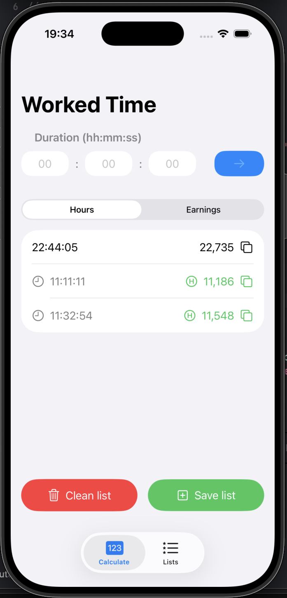
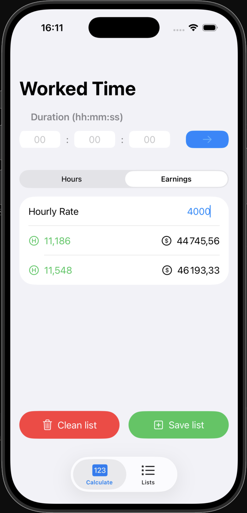
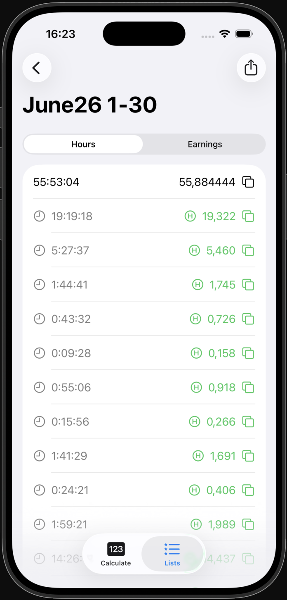
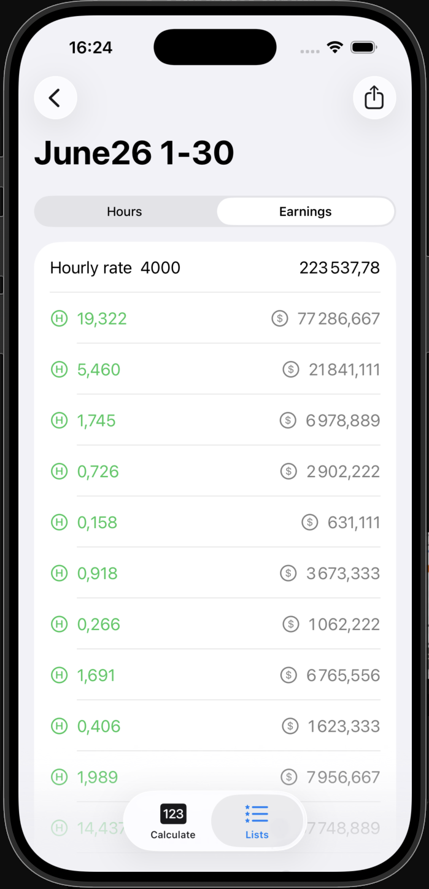
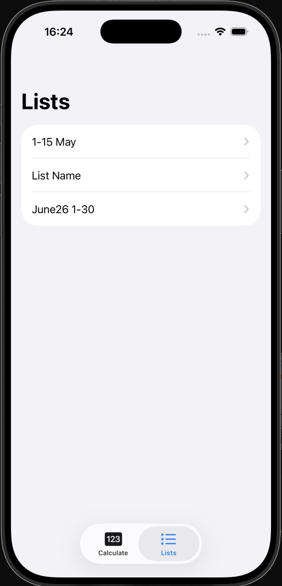
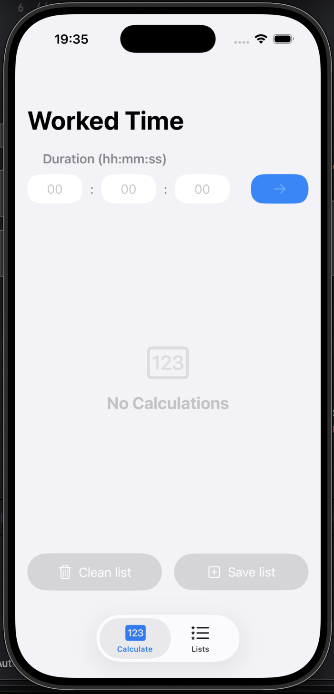

# Billiable Hours

A freelance time-tracking app for iOS and macOS. Log your work sessions in hh:mm:ss format, convert them to decimal hours, calculate earnings at your hourly rate, and export reports as CSV.

Built as a portfolio project to practice SwiftUI, SwiftData, and native iOS patterns.

---

## Screenshots

<p float="left">
  
  
  
  
</p>

<p float="left">
  
  
</p>

---

## Features

- **Time entry** — enter duration in hh:mm:ss with input validation
- **Hours view** — converts each entry to decimal hours, shows total duration and total hours
- **Earnings view** — enter your hourly rate and see per-entry and total earnings instantly
- **Save lists** — snapshot the current working queue into a named list with one tap
- **List detail** — browse saved lists in Hours or Earnings mode
- **CSV export** — export any saved list as a semicolon-delimited CSV (Duration, Hours, Earnings) via the native share sheet; opens correctly in Numbers and Excel
- **Copy to clipboard** — copy any value with one tap, locale-aware decimal separator
- **Dark Mode** — full support
- **Mac Catalyst** — runs natively on macOS

---

## Tech Stack

- **SwiftUI** — declarative UI
- **SwiftData** — persistence layer with `@Model` classes
- **Swift Testing** — unit tests for core calculation and validation logic
- **Mac Catalyst** — macOS support from the same codebase

---

## Architecture

```
Billiable Hours
├── ViewModels
│   ├── HoursFieldsModel.swift   — @Model, calculation + validation logic
│   ├── HoursList.swift          — @Model, archived list + ArchivedCalculation struct
│   ├── ViewMode.swift           — enum (hours / earnings)
│   └── PreviewData.swift        — in-memory container with sample data for previews
├── Views
│   ├── Buttons
│   │   ├── CalcButton.swift     — submits a new calculation to SwiftData context
│   │   └── CopyButton.swift     — copies a Double to clipboard with Locale.current
│   ├── CalcHoursFields.swift    — working queue list, segment picker, Clean/Save buttons
│   ├── ListsView.swift          — saved lists browser
│   ├── ListDetail.swift         — detail view with Hours/Earnings toggle and CSV export
│   └── NewListView.swift        — modal for naming and saving the current queue
└── ViewModifiers
    ├── ButtonsListControlStyle  — shared style for Clean/Save buttons
    └── NumberFieldBaseStyle     — shared style for time input fields
```

Key design decisions:
- `ArchivedCalculation` is a `Codable` struct (not a `@Model` class) — snapshots are immutable and safe from cascade deletes
- `CopyButton` uses `Locale.current` so the decimal separator matches the user's region in all target apps
- CSV uses `;` as delimiter to avoid conflicts with locale-formatted numbers containing `,`

---

## Requirements

- iOS 18.4+
- macOS 15+ (Mac Catalyst)
- Xcode 16+

---

## Getting Started

1. Clone the repo
2. Open `BilliableHours.xcodeproj` in Xcode
3. Select a simulator or your device and run
